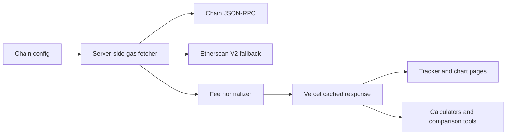

# feat: Add EVM gas tracker and fee tools

## Overview

Build GasFees.org from a static education site into a practical gas fee utility by adding live EVM gas trackers, chain comparison pages, and small calculators. The primary data path should use EVM JSON-RPC fee methods across configured chains, with Etherscan API V2 Gas Oracle as an optional fallback for supported networks.

---

## Problem Frame

Users come to GasFees.org to answer practical transaction-cost questions: “What does it cost right now?”, “Which chain is cheaper?”, “Should I wait?”, and “What fee should I choose?” The current site explains gas fees well, but it does not yet provide live tracker data for Ethereum or EVM chains.

---

## Requirements Trace

- R1. Pull current gas pricing for Ethereum and major EVM chains.
- R2. Normalize chain-specific gas data into comparable slow/standard/fast fee estimates.
- R3. Make tracker pages fast and resilient on Vercel.
- R4. Avoid exposing API keys to the browser.
- R5. Add SEO-friendly tracker and tool pages that are useful even if live data is temporarily unavailable.

---

## Scope Boundaries

- This plan covers EVM-compatible chains first. Solana, Aptos, Bitcoin, and non-EVM fee models should be separate follow-up plans.
- This plan does not build trading, wallet connection, transaction submission, or personalized portfolio advice.
- This plan does not promise exact transaction costs for every smart contract call. It estimates network fee conditions and simple transaction costs.

### Deferred to Follow-Up Work

- Historical chart storage and trend analysis can follow after the live data layer is reliable.
- Alerting, email subscriptions, and user accounts are out of scope for the first tracker release.

---

## Context & Research

### Relevant Code and Patterns

- `content/blockchains.ts` already defines chain landing-page content.
- `content/tools.ts` already lists tools shown on `/tools` and the homepage.
- `app/charts/page.tsx` is the current placeholder for tracker/chart work.
- `app/tools/aptos-gas-fee-calculator/page.tsx` provides a pattern for a lightweight interactive tool page.
- `lib/content/schemas.ts` has typed content schemas that can be extended for chain RPC metadata.
- `lib/seo/schema.ts` can be extended with `WebApplication`, `SoftwareApplication`, `Dataset`, or `ItemList` schema once tracker pages exist.

### External References

- EVM JSON-RPC fee methods: `eth_feeHistory`, `eth_gasPrice`, and `eth_maxPriorityFeePerGas`.
- Etherscan API V2 Gas Oracle supports 60+ EVM chains with one API key via `chainid`, `module=gastracker`, and `action=gasoracle`.

---

## Key Technical Decisions

- Use chain-specific JSON-RPC endpoints as the primary source so the tracker is not locked to one vendor.
- Use `eth_feeHistory` as the preferred method on EIP-1559 chains because it exposes base fee, gas usage ratio, and priority-fee percentiles.
- Fall back to `eth_gasPrice` for legacy or incomplete RPC support.
- Add Etherscan V2 as a fallback or cross-check, not as the only source, because it has rate limits and may not cover every future chain.
- Cache API responses server-side using short revalidation windows so the site remains fast and does not hammer providers.
- Keep all provider keys in Vercel environment variables and only expose normalized tracker results to the browser.

---

## High-Level Technical Design

> *This illustrates the intended approach and is directional guidance for review, not implementation specification. The implementing agent should treat it as context, not code to reproduce.*

---

## Implementation Units

- [ ] U1. **EVM chain configuration**

**Goal:** Define the supported EVM chains, RPC configuration, native tokens, decimals, explorer links, and display metadata.

**Requirements:** R1, R2, R5

**Dependencies:** None

**Files:**
- Create: `content/evm-chains.ts`
- Modify: `lib/content/schemas.ts`
- Test: `content/evm-chains.test.ts`

**Approach:**
- Start with Ethereum, Base, Arbitrum, Optimism, Polygon, BNB Chain, Avalanche, and Linea or another high-value EVM chain.
- Store env var names, not secrets, in config.
- Include flags for EIP-1559 support and fallback behavior.

**Test scenarios:**
- Happy path: each chain config parses with chain ID, name, native token, and RPC env var name.
- Edge case: duplicate chain IDs are rejected.
- Error path: missing required RPC config is reported before runtime.

**Verification:**
- A typed chain list can drive UI, fetchers, and sitemap entries without duplicated chain constants.

- [ ] U2. **Server-side gas data provider**

**Goal:** Fetch current gas data from chain RPC endpoints and normalize it into slow/standard/fast fee estimates.

**Requirements:** R1, R2, R3, R4

**Dependencies:** U1

**Files:**
- Create: `lib/gas/evm-provider.ts`
- Create: `lib/gas/normalize-fees.ts`
- Create: `app/api/gas/evm/route.ts`
- Test: `lib/gas/evm-provider.test.ts`
- Test: `lib/gas/normalize-fees.test.ts`

**Approach:**
- Prefer `eth_feeHistory` with priority-fee percentiles for EIP-1559 chains.
- Use `eth_maxPriorityFeePerGas` where available to sanity-check suggested priority fees.
- Fall back to `eth_gasPrice` and mark confidence lower when detailed fee history is unavailable.
- Return normalized gwei values, native-token estimates for simple transfers, block number, source, stale status, and last updated time.

**Test scenarios:**
- Happy path: EIP-1559 response produces slow/standard/fast base plus priority fee estimates.
- Edge case: legacy chain without fee history returns gas price-based estimates.
- Error path: RPC timeout returns a structured unavailable state, not a crashed page.
- Integration: API route never exposes raw API keys or provider URLs.

**Verification:**
- The API returns stable JSON for configured chains and degrades gracefully when one chain fails.

- [ ] U3. **Etherscan V2 fallback**

**Goal:** Add optional fallback data from Etherscan V2 Gas Oracle for supported chains.

**Requirements:** R1, R3, R4

**Dependencies:** U1, U2

**Files:**
- Create: `lib/gas/etherscan-provider.ts`
- Modify: `lib/gas/evm-provider.ts`
- Test: `lib/gas/etherscan-provider.test.ts`

**Approach:**
- Use one server-side `ETHERSCAN_API_KEY`.
- Request `https://api.etherscan.io/v2/api?chainid=<CHAIN_ID>&module=gastracker&action=gasoracle`.
- Normalize `SafeGasPrice`, `ProposeGasPrice`, `FastGasPrice`, `suggestBaseFee`, and `LastBlock`.
- Use fallback only when RPC fails or as a secondary source for supported chains.

**Test scenarios:**
- Happy path: Etherscan gas oracle response maps into the common gas data shape.
- Edge case: unsupported chain skips Etherscan fallback.
- Error path: rate-limit or invalid-key responses produce unavailable fallback status.

**Verification:**
- A chain can recover from RPC failure when Etherscan supports the chain.

- [ ] U4. **Tracker pages and homepage/tool integration**

**Goal:** Replace the current charts placeholder with useful tracker pages and promote them from homepage/tools.

**Requirements:** R2, R3, R5

**Dependencies:** U1, U2

**Files:**
- Modify: `app/charts/page.tsx`
- Create: `app/charts/evm/page.tsx`
- Create: `app/charts/evm/[chain]/page.tsx`
- Modify: `content/tools.ts`
- Modify: `app/page.tsx`
- Test: `app/charts/evm/page.test.tsx`

**Approach:**
- Build an EVM overview table with chain, slow/standard/fast, simple transfer estimate, last updated, and source confidence.
- Add individual chain tracker pages with fee explanation, current values, and links to related guides.
- Keep the page useful when live data is unavailable by showing educational fallback copy.

**Test scenarios:**
- Happy path: tracker overview renders normalized gas data for multiple chains.
- Edge case: one chain unavailable shows an inline stale/unavailable state without breaking the table.
- Error path: all providers unavailable still renders explanatory content and no misleading prices.
- Integration: homepage links to the live tracker instead of beta-only chart copy once ready.

**Verification:**
- `/charts/evm` and chain tracker routes render fast, are mobile-readable, and include clear timestamps.

- [ ] U5. **Gas calculators and comparison tools**

**Goal:** Add practical tools that use the same normalized fee data.

**Requirements:** R2, R3, R5

**Dependencies:** U2, U4

**Files:**
- Create: `app/tools/evm-gas-calculator/page.tsx`
- Create: `app/tools/compare-evm-gas/page.tsx`
- Modify: `content/tools.ts`
- Test: `app/tools/evm-gas-calculator/page.test.tsx`

**Approach:**
- EVM gas calculator: choose chain, gas units, priority mode, and token/USD assumptions.
- EVM comparison tool: compare simple transfer estimates across chains.
- Avoid wallet-connection scope; this is educational estimation only.

**Test scenarios:**
- Happy path: user enters gas units and sees estimated native-token cost.
- Edge case: missing USD price still shows gwei/native-token cost.
- Error path: unavailable live fees produce a manual-input fallback.

**Verification:**
- Tool outputs are labeled as estimates and reuse the same data freshness indicators as tracker pages.

- [ ] U6. **SEO and structured data for tools**

**Goal:** Make tracker/tool pages indexable and accurately described for search.

**Requirements:** R5

**Dependencies:** U4, U5

**Files:**
- Modify: `lib/seo/schema.ts`
- Modify: `app/sitemap.ts`
- Modify: `app/charts/evm/page.tsx`
- Modify: `app/tools/evm-gas-calculator/page.tsx`
- Test: `lib/seo/schema.test.ts`

**Approach:**
- Add `WebApplication`/`SoftwareApplication` schema for tools.
- Add `ItemList` schema for tracker overview pages.
- Add canonical metadata and sitemap entries for tracker and calculator pages.

**Test scenarios:**
- Happy path: tool pages emit application schema with name, description, and canonical URL.
- Edge case: live data failure does not affect schema validity.
- Integration: sitemap includes tracker/tool routes after launch.

**Verification:**
- Tool pages validate in structured data tools and are discoverable from sitemap and internal links.

---

## Risks & Dependencies

- **Provider reliability:** RPC endpoints may rate-limit or differ by chain. Mitigate with per-chain providers, short caching, fallback, and structured unavailable states.
- **Cost accuracy:** Gas estimates are not total dApp transaction costs. Mitigate by labeling outputs as estimates and explaining gas units.
- **API key exposure:** Provider keys must stay server-side. Mitigate with server routes and environment variables only.
- **Crawler quality:** Thin tool pages can underperform. Mitigate with useful explanatory copy, related guides, timestamps, and clear schema.

---

## Documentation / Operational Notes

- Add Vercel env vars for RPC URLs and `ETHERSCAN_API_KEY`.
- Document provider limits and supported chains in `README.md`.
- Monitor API latency, error rate, and cache hit behavior after launch.
- Once live data is stable, consider storing historical snapshots for charts and trend pages.
